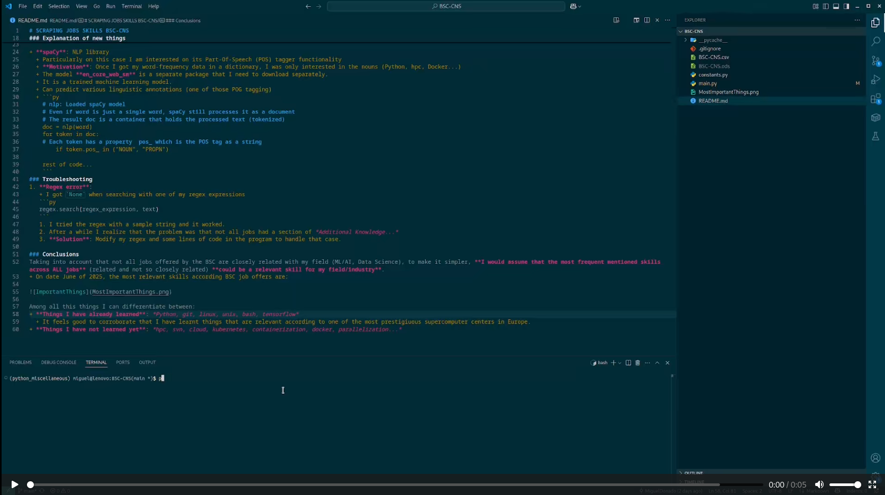

# SCRAPING JOBS SKILLS BSC-CNS
<!-- TOC -->
- [SCRAPING JOBS SKILLS BSC-CNS](#scraping-jobs-skills-bsc-cns)
    - [1. Brief history of BSC-CNS](#1-brief-history-of-bsc-cns)
    - [2. Motivation of this project](#2-motivation-of-this-project)
    - [3. Implementation](#3-implementation)
    - [4. Explanation of new things](#4-explanation-of-new-things)
    - [5. Troubleshooting](#5-troubleshooting)
    - [6. Conclusions](#6-conclusions)
    - [7. Usage](#7-usage)
    - [8. Video](#8-video)

<!-- /TOC -->
### 1. Brief history of BSC-CNS
+ Barcelona Supercomputing Center is a national supercomputing centre in Spain. They are specialized in high performance computing (HPC) and manage MareNostrum, the most powerful supercomputing in Spain, and one of the most importants in Europe.
### 2. Motivation of this project
+ Because BSC is a top-notch institution in the IT field, I assume that they are up to date with the latest and most important skills, programmes that are needed in the IT field.
+ Based on that, it makes sense to check the requirements sections of the job opportunities available.
+ Therefore, the most frequently mentioned skills and software suggest what is currently relevant in the industry (June 2025).
### 3. Implementation
+ Python
+ Selenium (scrape)
+ Regex (parse)
+ Spacy (POS tagger)

+ **Source code**:
  + `main.py`: Script that contains all the logic
  + `constants.py`: File that contains some regex expressions and a url. 
+ The scraping has been done taking into account unigrams (word counts). N-grams has not been implemented, probably a combination of both (unigram and n-gram) could lead to better results.
### 4. Explanation of new things
+ **POG tagging**: Given a word, assign a tag.
  + NOUN: common noun
  + PROPN: proper noun
  + ...
   
+ **spaCy**: NLP library
  + Particularly on this case I am interested on its Part-Of-Speech (POS) tagger functionality
  + **Motivation**: Once I got my word-frequency data in a dictionary, I was only interested in the nouns (Python, hpc, Docker...)
  + The model **en_core_web_sm** is a separate package that I need to download separately.
  + It is a trained machine learning model. 
  + Can predict various linguistic annotations (one of those POG tagging)
  + ```py
    # nlp: Loaded spaCy model
    # Even if word is just a single word, spaCy still processes it as a document
    # The result doc is a container that holds the processed text (tokenized)
    doc = nlp(word) 
    for token in doc:
    # Each token has a property  pos_ which is the POS tag as a string
        if token.pos_ in ("NOUN", "PROPN")
    
    rest of code...
    ```
### 5. Troubleshooting
1. **Regex error**:
   + I got `None` when searching with one of my regex expressions 
   ```py
   regex.search(regex_expression, text)
   ``` 
   1. I tried the regex with a sample string and it worked. 
   2. After a while I realize that the problem was that not all jobs had a section of *Additional Knowledge...* 
   3. **Solution**: Modify my regex and some lines of code in the program to handle that case. 

### 6. Conclusions
Taking into account that not all jobs offered by the BSC are closely related with my field (ML/AI, Data Science), to make it simpler, **I would assume that the most frequent mentioned skills across ALL jobs** (related and not so closely related) **could be a relevant skill for my field/industry**.
+ On date June of 2025, the most relevant skills according BSC job offers are:
  


Among all this things I can differentiate between:
+ **Things I have already learned**: *Python, git, linux, unix, bash, tensorflow*
  + It feels good to corroborate that I have learnt things that are relevant according to one of the most prestigiuous supercomputer centers in Europe.
+ **Things I have not learned yet**: *hpc, svn, cloud, kubernetes, containerization, docker, parallelization...*

### 7. Usage
0. Create and activate a virtual environment
```bash
  python3 -m venv venv
  source venv/bin/activate
```
1. Install dependencies
```bash
  pip install -r requirements.txt
```
2. Execute the main script: `python main.py`
3. Analyze `BSC-CNS.csv` 

### 8. Video
+ Small video showing the correct execution of the project, particularly of the `main.py`
[](https://github.com/user-attachments/assets/ff5c9f21-026c-459d-9f2d-1b41bf175c84)


