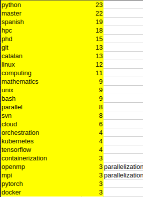

# SCRAPING JOBS SKILLS BSC-CNS
### Brief history of BSC-CNS
+ Barcelona Supercomputing Center is a national supercomputing centre in Spain. They are specialized in high performance computing (HPC) and manage MareNostrum, the most powerful supercomputing in Spain, and one of the most importants in Europe.
### Motivation of this project
+ Because BSC is a top-notch institution in the IT field, I assume that they are up to date with the latest and most important skills, programmes that are needed in the IT field.
+ Based on that, it makes sense to check the requirements sections of the job opportunities available.
+ Therefore, the most frequently mentioned skills and software suggest what is currently relevant in the industry (June 2025).
### Implementation
+ Python
+ Selenium (scrape)
+ Regex (parse)
+ Spacy (POS tagger)
### Explanation of new things
+ **POG tagging**: Given a word, assign a tag.
  + NOUN: common noun
  + PROPN: proper noun
  + ...
   
+ **spaCy**: NLP library
  + Particularly on this case I am interested on its Part-Of-Speech (POS) tagger functionality
  + **Motivation**: Once I got my word-frequency data in a dictionary, I was only interested in the nouns (Python, hpc, Docker...)
  + The model **en_core_web_sm** is a separate package that I need to download separately.
  + It is a trained machine learning model. 
  + Can predict various linguistic annotations (one of those POG tagging)
  + ```py
    # nlp: Loaded spaCy model
    # Even if word is just a single word, spaCy still processes it as a document
    # The result doc is a container that holds the processed text (tokenized)
    doc = nlp(word) 
    for token in doc:
    # Each token has a property  pos_ which is the POS tag as a string
        if token.pos_ in ("NOUN", "PROPN")
    
    rest of code...
    ```
### Troubleshooting
1. I got an error when using regex. When searching for a regex expression on my text, I got None. So it looked like my regex expression wasn't correct. But I tried it with a sample and it worked. After a while I realize that the problem was that not all jobs had a section of *Additional Knowledge...". The solution was to modify my regex and some lines of code in the program to handle that case. 

### Conclusions
Taking into account that not all jobs offered by the BSC are closely related with my field (ML/AI, Data Science), to make it simpler, I would assume that the most frequent mentioned skills across **ALL jobs** (related and not so closely related) could be a relevant skill for my field/industry.
+ On date June of 2025, the most relevant skills according BSC job offers are:
  

  
+ Things I have already learned: Python, git, linux, unix, bash, tensorflow
  + It feels good to corroborate that I have learnt things that are relevant according to one of the most prestigiuous supercomputer centers in Europe.
+ Things I have not learned yet: hpc, svn, cloud, kubernetes, containerization, docker, parallelization...